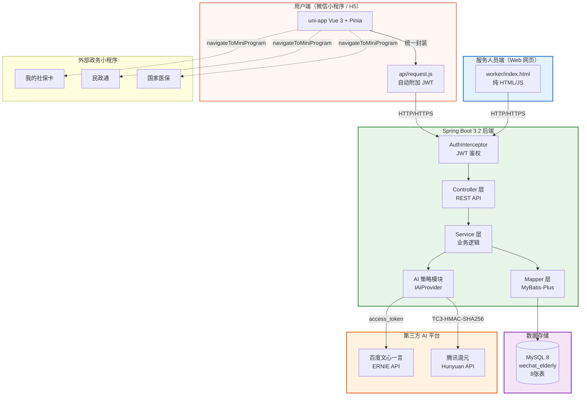

# 系统总体架构图

```mermaid
graph TB
    subgraph 用户端["用户端（微信小程序 / H5）"]
        MP[uni-app Vue 3 + Pinia]
        MP -->|统一封装| REQ[api/request.js<br/>自动附加 JWT]
    end

    subgraph 服务人员端["服务人员端（Web 网页）"]
        WK[worker/index.html<br/>纯 HTML/JS]
    end

    subgraph 后端服务["Spring Boot 3.2 后端"]
        AUTH[AuthInterceptor<br/>JWT 鉴权]
        CTRL[Controller 层<br/>REST API]
        SVC[Service 层<br/>业务逻辑]
        MAPPER[Mapper 层<br/>MyBatis-Plus]
        AI_SVC[AI 策略模块<br/>IAiProvider]
    end

    subgraph 数据层["数据存储"]
        DB[(MySQL 8<br/>wechat_elderly<br/>8张表)]
    end

    subgraph 第三方AI["第三方 AI 平台"]
        BAIDU[百度文心一言<br/>ERNIE API]
        TENCENT[腾讯混元<br/>Hunyuan API]
    end

    subgraph 外部小程序["外部政务小程序"]
        SB[我的社保卡]
        MZ[民政通]
        YB[国家医保]
    end

    REQ -->|HTTP/HTTPS| AUTH
    WK -->|HTTP/HTTPS| AUTH
    AUTH --> CTRL
    CTRL --> SVC
    SVC --> MAPPER
    MAPPER --> DB
    SVC --> AI_SVC
    AI_SVC -->|TC3-HMAC-SHA256| TENCENT
    AI_SVC -->|access_token| BAIDU
    MP -.->|navigateToMiniProgram| SB
    MP -.->|navigateToMiniProgram| MZ
    MP -.->|navigateToMiniProgram| YB

    style 用户端 fill:#fff7f3,stroke:#e76f51,stroke-width:2px
    style 服务人员端 fill:#e3f2fd,stroke:#1565c0,stroke-width:2px
    style 后端服务 fill:#e8f5e9,stroke:#2e7d32,stroke-width:2px
    style 数据层 fill:#f3e5f5,stroke:#7b1fa2,stroke-width:2px
    style 第三方AI fill:#fff3e0,stroke:#e65100,stroke-width:2px
```
