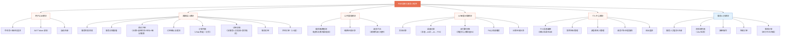

# 功能模块图

```mermaid
graph TD
    SYS["社区适老化服务小程序"]

    SYS --> A["用户认证模块"]
    SYS --> B["滴滴摇人模块"]
    SYS --> C["公共服务模块"]
    SYS --> D["AI 智能问答模块"]
    SYS --> E["个人中心模块"]
    SYS --> F["服务人员模块"]

    A --> A1["手机号+验证码登录"]
    A --> A2["JWT Token 鉴权"]
    A --> A3["自动注册"]

    B --> B1["服务列表浏览"]
    B --> B2["服务详情查看"]
    B --> B3["预约下单<br/>（日期+滚轮时间+地址+细分需求）"]
    B --> B4["订单确认与提交"]
    B --> B5["订单列表<br/>（4Tab 筛选 + 分页）"]
    B --> B6["订单详情<br/>（含服务人员信息+拨打电话）"]
    B --> B7["取消订单"]
    B --> B8["评价订单（1-5星）"]

    C --> C1["便民缴费查询<br/>（电费/水费/有线电视）"]
    C --> C2["缴费历史记录"]
    C --> C3["政务代办<br/>（跳转外部小程序）"]

    D --> D1["文本问答"]
    D --> D2["语音问答<br/>（录音→ASR→AI→TTS）"]
    D --> D3["双引擎切换<br/>（百度文心/腾讯混元）"]
    D --> D4["FAQ 语音播报"]
    D --> D5["问答历史记录"]

    E --> E1["个人信息编辑<br/>（姓名/年龄/社区）"]
    E --> E2["常用地址管理"]
    E --> E3["紧急联系人管理"]
    E --> E4["政务代办进度查询"]
    E --> E5["退出登录"]

    F --> F1["服务人员登录/注册"]
    F --> F2["待抢单列表<br/>（10s 轮询）"]
    F --> F3["接单操作"]
    F --> F4["完成订单"]
    F --> F5["我的订单<br/>（进行中/已完成）"]

    style SYS fill:#e76f51,color:#fff,stroke:none
    style A fill:#fff7f3,stroke:#e76f51
    style B fill:#fff7f3,stroke:#e76f51
    style C fill:#fff7f3,stroke:#e76f51
    style D fill:#fff7f3,stroke:#e76f51
    style E fill:#fff7f3,stroke:#e76f51
    style F fill:#e3f2fd,stroke:#1565c0
```
