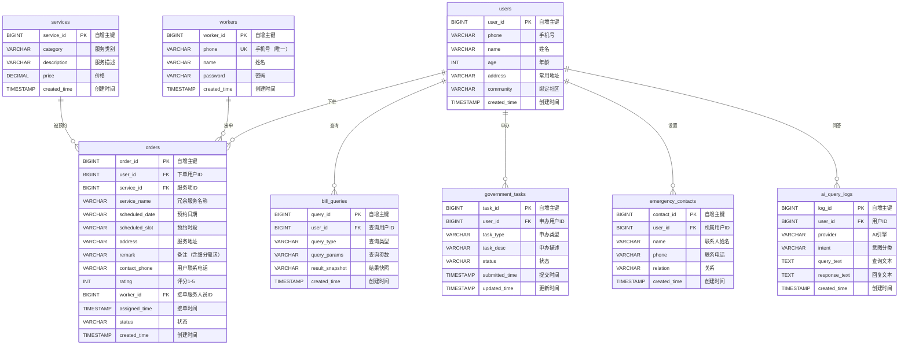

# 数据库 E-R 图

```mermaid
erDiagram
    users {
        BIGINT user_id PK "自增主键"
        VARCHAR phone "手机号"
        VARCHAR name "姓名"
        INT age "年龄"
        VARCHAR address "常用地址"
        VARCHAR community "绑定社区"
        TIMESTAMP created_time "创建时间"
    }

    services {
        BIGINT service_id PK "自增主键"
        VARCHAR category "服务类别"
        VARCHAR description "服务描述"
        DECIMAL price "价格"
        TIMESTAMP created_time "创建时间"
    }

    workers {
        BIGINT worker_id PK "自增主键"
        VARCHAR phone UK "手机号（唯一）"
        VARCHAR name "姓名"
        VARCHAR password "密码"
        TIMESTAMP created_time "创建时间"
    }

    orders {
        BIGINT order_id PK "自增主键"
        BIGINT user_id FK "下单用户ID"
        BIGINT service_id FK "服务项ID"
        VARCHAR service_name "冗余服务名称"
        VARCHAR scheduled_date "预约日期"
        VARCHAR scheduled_slot "预约时段"
        VARCHAR address "服务地址"
        VARCHAR remark "备注（含细分需求）"
        VARCHAR contact_phone "用户联系电话"
        INT rating "评分1-5"
        BIGINT worker_id FK "接单服务人员ID"
        TIMESTAMP assigned_time "接单时间"
        VARCHAR status "状态"
        TIMESTAMP created_time "创建时间"
    }

    bill_queries {
        BIGINT query_id PK "自增主键"
        BIGINT user_id FK "查询用户ID"
        VARCHAR query_type "查询类型"
        VARCHAR query_params "查询参数"
        VARCHAR result_snapshot "结果快照"
        TIMESTAMP created_time "创建时间"
    }

    government_tasks {
        BIGINT task_id PK "自增主键"
        BIGINT user_id FK "申办用户ID"
        VARCHAR task_type "申办类型"
        VARCHAR task_desc "申办描述"
        VARCHAR status "状态"
        TIMESTAMP submitted_time "提交时间"
        TIMESTAMP updated_time "更新时间"
    }

    emergency_contacts {
        BIGINT contact_id PK "自增主键"
        BIGINT user_id FK "所属用户ID"
        VARCHAR name "联系人姓名"
        VARCHAR phone "联系电话"
        VARCHAR relation "关系"
        TIMESTAMP created_time "创建时间"
    }

    ai_query_logs {
        BIGINT log_id PK "自增主键"
        BIGINT user_id FK "用户ID"
        VARCHAR provider "AI引擎"
        VARCHAR intent "意图分类"
        TEXT query_text "查询文本"
        TEXT response_text "回复文本"
        TIMESTAMP created_time "创建时间"
    }

    users ||--o{ orders : "下单"
    users ||--o{ bill_queries : "查询"
    users ||--o{ government_tasks : "申办"
    users ||--o{ emergency_contacts : "设置"
    users ||--o{ ai_query_logs : "问答"
    services ||--o{ orders : "被预约"
    workers ||--o{ orders : "接单"
```
