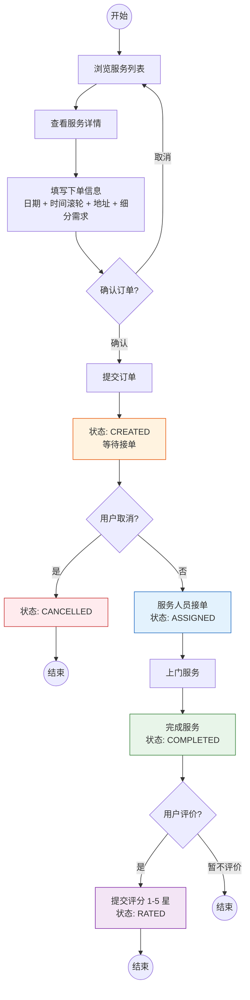
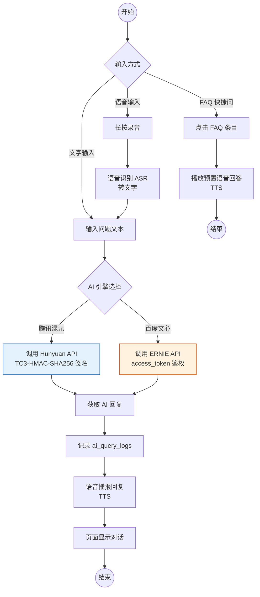
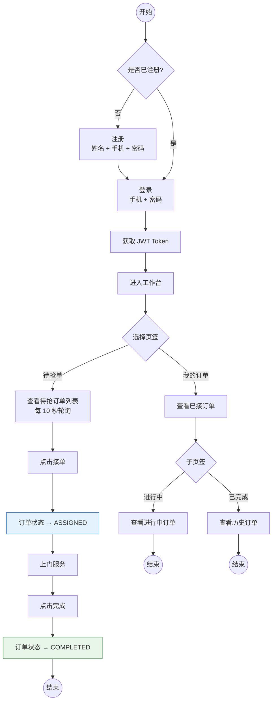

# 业务流程图

## 1. 订单全生命周期流程

```mermaid
flowchart TD
    START((开始)) --> BROWSE[浏览服务列表]
    BROWSE --> VIEW[查看服务详情]
    VIEW --> CREATE[填写下单信息<br/>日期 + 时间滚轮 + 地址 + 细分需求]
    CREATE --> CONFIRM{确认订单?}
    CONFIRM -->|取消| BROWSE
    CONFIRM -->|确认| SUBMIT[提交订单]
    SUBMIT --> CREATED[状态: CREATED<br/>等待接单]
    CREATED --> CANCEL_CHK{用户取消?}
    CANCEL_CHK -->|是| CANCELLED[状态: CANCELLED]
    CANCELLED --> END1((结束))
    CANCEL_CHK -->|否| ASSIGNED[服务人员接单<br/>状态: ASSIGNED]
    ASSIGNED --> SERVICE[上门服务]
    SERVICE --> COMPLETED[完成服务<br/>状态: COMPLETED]
    COMPLETED --> RATE_CHK{用户评价?}
    RATE_CHK -->|是| RATED[提交评分 1-5 星<br/>状态: RATED]
    RATE_CHK -->|暂不评价| END2((结束))
    RATED --> END3((结束))

    style CREATED fill:#fff3e0,stroke:#e65100
    style ASSIGNED fill:#e3f2fd,stroke:#1565c0
    style COMPLETED fill:#e8f5e9,stroke:#2e7d32
    style RATED fill:#f3e5f5,stroke:#7b1fa2
    style CANCELLED fill:#ffebee,stroke:#c62828
```

## 2. AI 智能问答流程

```mermaid
flowchart TD
    START((开始)) --> MODE{输入方式}
    MODE -->|文字输入| TEXT[输入问题文本]
    MODE -->|语音输入| RECORD[长按录音]
    MODE -->|FAQ 快捷问| FAQ[点击 FAQ 条目]

    RECORD --> ASR[语音识别 ASR<br/>转文字]
    ASR --> TEXT

    FAQ --> AUDIO[播放预置语音回答<br/>TTS]
    AUDIO --> END1((结束))

    TEXT --> PROVIDER{AI 引擎选择}
    PROVIDER -->|腾讯混元| TENCENT[调用 Hunyuan API<br/>TC3-HMAC-SHA256 签名]
    PROVIDER -->|百度文心| BAIDU[调用 ERNIE API<br/>access_token 鉴权]

    TENCENT --> RESP[获取 AI 回复]
    BAIDU --> RESP

    RESP --> LOG[记录 ai_query_logs]
    LOG --> TTS[语音播报回复<br/>TTS]
    TTS --> DISPLAY[页面显示对话]
    DISPLAY --> END2((结束))

    style TENCENT fill:#e3f2fd,stroke:#1565c0
    style BAIDU fill:#fff3e0,stroke:#e65100
```

## 3. 服务人员工作流程

```mermaid
flowchart TD
    START((开始)) --> REG_CHK{是否已注册?}
    REG_CHK -->|否| REGISTER[注册<br/>姓名 + 手机 + 密码]
    REGISTER --> LOGIN
    REG_CHK -->|是| LOGIN[登录<br/>手机 + 密码]

    LOGIN --> TOKEN[获取 JWT Token]
    TOKEN --> DASH[进入工作台]

    DASH --> TAB{选择页签}
    TAB -->|待抢单| PENDING[查看待抢订单列表<br/>每 10 秒轮询]
    TAB -->|我的订单| MY[查看已接订单]

    PENDING --> ACCEPT[点击接单]
    ACCEPT --> ASSIGNED[订单状态 → ASSIGNED]
    ASSIGNED --> DO_SERVICE[上门服务]
    DO_SERVICE --> FINISH[点击完成]
    FINISH --> COMPLETED[订单状态 → COMPLETED]
    COMPLETED --> END1((结束))

    MY --> MY_TAB{子页签}
    MY_TAB -->|进行中| ING[查看进行中订单]
    MY_TAB -->|已完成| DONE[查看历史订单]
    ING --> END2((结束))
    DONE --> END3((结束))

    style ASSIGNED fill:#e3f2fd,stroke:#1565c0
    style COMPLETED fill:#e8f5e9,stroke:#2e7d32
```
