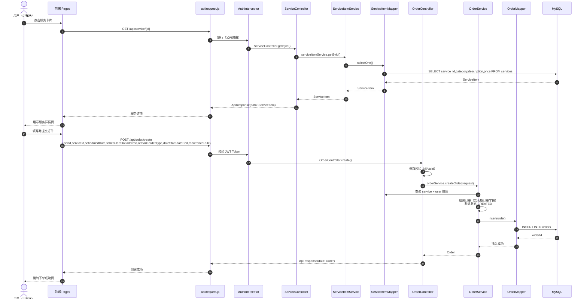
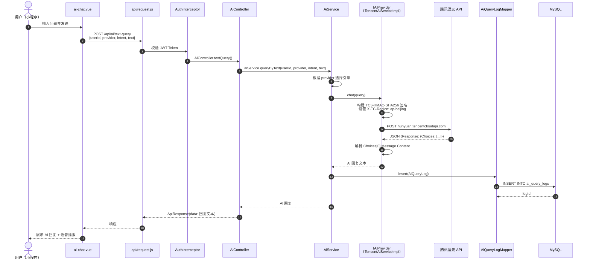

# 时序图

## 1. 用户下单时序图

```mermaid
sequenceDiagram
    autonumber
    actor U as 用户（小程序）
    participant FE as 前端 Pages
    participant API as api/request.js
    participant AUTH as AuthInterceptor
    participant SCTRL as ServiceController
    participant SSVC as ServiceItemService
    participant SM as ServiceItemMapper
    participant OCTRL as OrderController
    participant OSVC as OrderService
    participant OM as OrderMapper
    participant DB as MySQL

    U->>FE: 点击服务卡片
    FE->>API: GET /api/service/{id}
    API->>AUTH: 放行（公共路由）
    AUTH->>SCTRL: ServiceController.getById()
    SCTRL->>SSVC: serviceItemService.getById()
    SSVC->>SM: selectOne()
    SM->>DB: SELECT service_id,category,description,price FROM services
    DB-->>SM: ServiceItem
    SM-->>SSVC: ServiceItem
    SSVC-->>SCTRL: ServiceItem
    SCTRL-->>API: ApiResponse(data: ServiceItem)
    API-->>FE: 服务详情
    FE-->>U: 展示服务详情页

    U->>FE: 填写并提交订单
    FE->>API: POST /api/order/create<br/>{userId,serviceId,scheduledDate,scheduledSlot,address,remark,orderType,dateStart,dateEnd,recurrenceRule}
    API->>AUTH: 校验 JWT Token
    AUTH->>OCTRL: OrderController.create()
    OCTRL->>OCTRL: 参数校验（@Valid）
    OCTRL->>OSVC: orderService.createOrder(request)
    OSVC->>SM: 查询 service + user 快照
    OSVC->>OSVC: 组装订单（含长期订单字段）<br/>默认状态 CREATED
    OSVC->>OM: insert(order)
    OM->>DB: INSERT INTO orders
    DB-->>OM: orderId
    OM-->>OSVC: 插入成功
    OSVC-->>OCTRL: Order
    OCTRL-->>API: ApiResponse(data: Order)
    API-->>FE: 创建成功
    FE-->>U: 跳转下单成功页
```

## 2. AI 文本问答时序图

```mermaid
sequenceDiagram
    autonumber
    actor U as 用户（小程序）
    participant FE as ai-chat.vue
    participant API as api/request.js
    participant AUTH as AuthInterceptor
    participant CTRL as AiController
    participant SVC as AiService
    participant PROV as IAiProvider<br/>（TencentAiServiceImpl）
    participant EXT as 腾讯混元 API
    participant MP as AiQueryLogMapper
    participant DB as MySQL

    U->>FE: 输入问题并发送
    FE->>API: POST /api/ai/text-query<br/>{userId, provider, intent, text}
    API->>AUTH: 校验 JWT Token
    AUTH->>CTRL: AiController.textQuery()
    CTRL->>SVC: aiService.queryByText(userId, provider, intent, text)
    SVC->>SVC: 根据 provider 选择引擎
    SVC->>PROV: chat(query)
    PROV->>PROV: 构建 TC3-HMAC-SHA256 签名<br/>设置 X-TC-Region: ap-beijing
    PROV->>EXT: POST hunyuan.tencentcloudapi.com
    EXT-->>PROV: JSON {Response: {Choices: [...]}}
    PROV->>PROV: 解析 Choices[0].Message.Content
    PROV-->>SVC: AI 回复文本
    SVC->>MP: insert(AiQueryLog)
    MP->>DB: INSERT INTO ai_query_logs
    DB-->>MP: logId
    SVC-->>CTRL: AI 回复
    CTRL-->>API: ApiResponse(data: 回复文本)
    API-->>FE: 响应
    FE-->>U: 展示 AI 回复 + 语音播报
```
