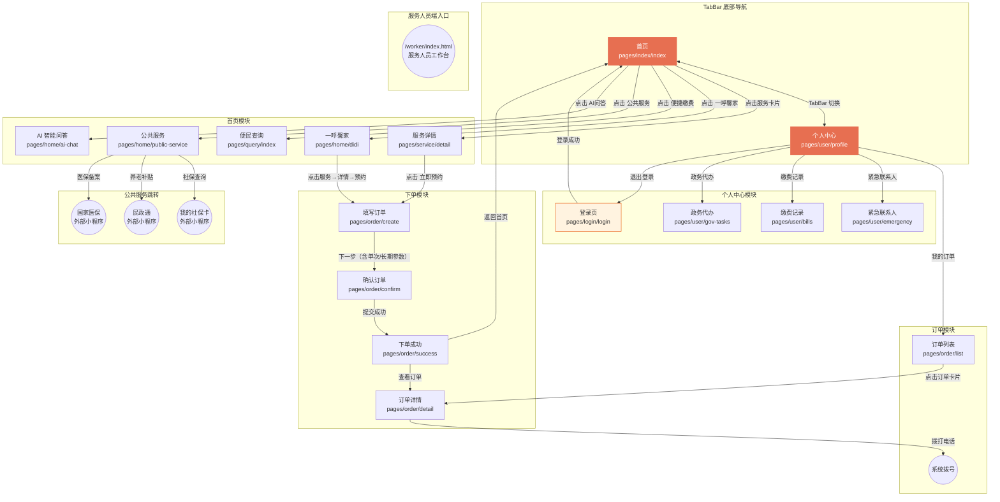

# 页面跳转流程图

```mermaid
flowchart TD
    subgraph TabBar["TabBar 底部导航"]
        INDEX["首页<br/>pages/index/index"]
        PROFILE["个人中心<br/>pages/user/profile"]
    end

    INDEX <-->|TabBar 切换| PROFILE

    subgraph 首页模块
        INDEX -->|点击服务卡片| SVC_DETAIL["服务详情<br/>pages/service/detail"]
        INDEX -->|点击 一呼馨家| DIDI["一呼馨家<br/>pages/home/didi"]
        INDEX -->|点击 便捷缴费| QUERY["便民查询<br/>pages/query/index"]
        INDEX -->|点击 公共服务| PUBLIC["公共服务<br/>pages/home/public-service"]
        INDEX -->|点击 AI问答| AI_CHAT["AI 智能问答<br/>pages/home/ai-chat"]
    end

    subgraph 下单模块
        SVC_DETAIL -->|点击 立即预约| ORDER_CREATE["填写订单<br/>pages/order/create"]
        DIDI -->|点击服务→详情→预约| ORDER_CREATE
        ORDER_CREATE -->|下一步（含单次/长期参数）| ORDER_CONFIRM["确认订单<br/>pages/order/confirm"]
        ORDER_CONFIRM -->|提交成功| ORDER_SUCCESS["下单成功<br/>pages/order/success"]
        ORDER_SUCCESS -->|查看订单| ORDER_DETAIL
        ORDER_SUCCESS -->|返回首页| INDEX
    end

    subgraph 订单模块
        PROFILE -->|我的订单| ORDER_LIST["订单列表<br/>pages/order/list"]
        ORDER_LIST -->|点击订单卡片| ORDER_DETAIL["订单详情<br/>pages/order/detail"]
        ORDER_DETAIL -->|拨打电话| PHONE_CALL((系统拨号))
    end

    subgraph 个人中心模块
        PROFILE -->|紧急联系人| EMERGENCY["紧急联系人<br/>pages/user/emergency"]
        PROFILE -->|缴费记录| BILLS["缴费记录<br/>pages/user/bills"]
        PROFILE -->|政务代办| GOV["政务代办<br/>pages/user/gov-tasks"]
        PROFILE -->|退出登录| LOGIN
    end

    subgraph 公共服务跳转
        PUBLIC -->|社保查询| EXT_SB((我的社保卡<br/>外部小程序))
        PUBLIC -->|养老补贴| EXT_MZ((民政通<br/>外部小程序))
        PUBLIC -->|医保备案| EXT_YB((国家医保<br/>外部小程序))
    end

    subgraph 服务人员端入口
        WORKER_WEB((/worker/index.html<br/>服务人员工作台))
    end

    LOGIN["登录页<br/>pages/login/login"]
    LOGIN -->|登录成功| INDEX

    style INDEX fill:#e76f51,color:#fff,stroke:none
    style PROFILE fill:#e76f51,color:#fff,stroke:none
    style LOGIN fill:#fff3e0,stroke:#e65100
```
