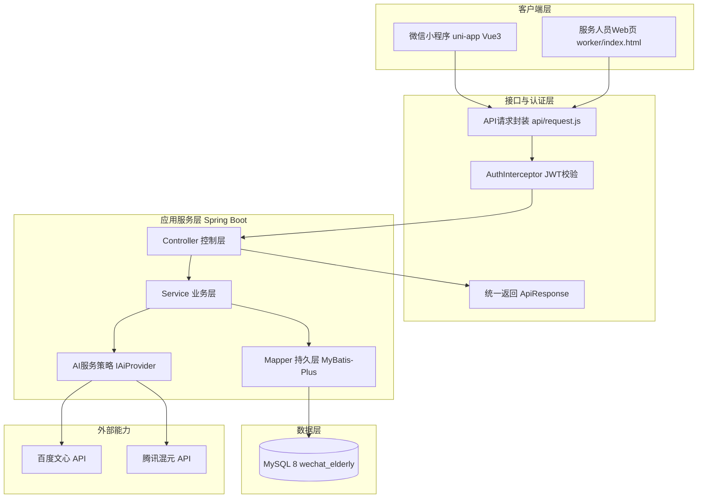
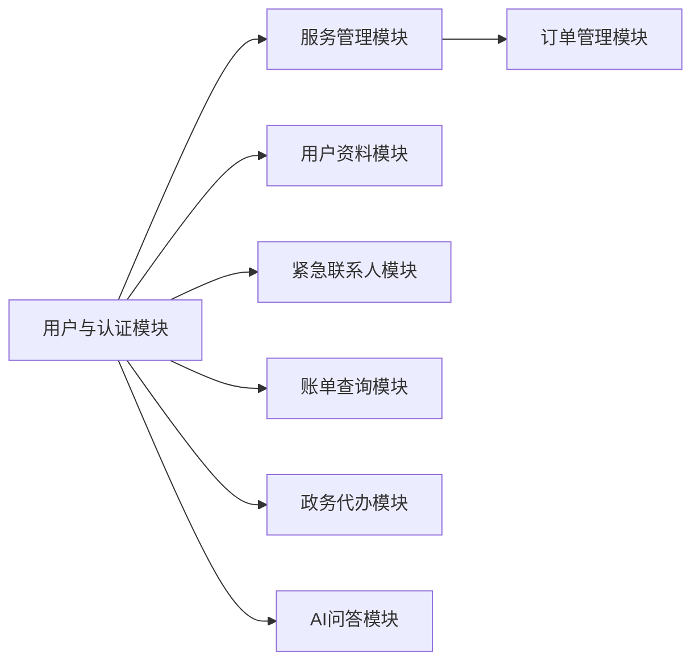
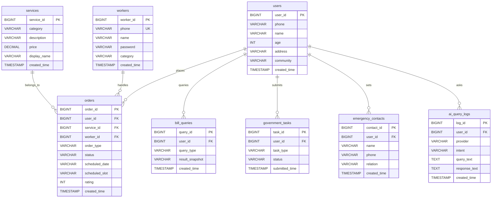

# 银龄馨家系统结构、数据库与可行性分析

## 1. 项目系统结构

### 1.1 总体架构说明
本项目采用前后端分离架构，由微信小程序前端、Spring Boot 后端、MySQL 数据库及第三方 AI 服务组成。
前端通过统一请求封装模块向后端发起 HTTP 请求，后端使用拦截器完成 JWT 鉴权，采用 Controller -> Service -> Mapper 分层处理业务并访问数据库。

### 1.2 系统架构图

### 1.3 功能模块图

## 2. 数据库设计

### 2.1 数据库概况
- 数据库名称: `wechat_elderly`
- 数据库类型: MySQL 8
- 字符集: `utf8mb4`
- 当前业务表数量: 8 张

### 2.2 核心 E-R 图

### 2.3 数据表说明

| 表名 | 主要作用 | 关键字段 |
|---|---|---|
| `users` | 存储老年用户基本资料与社区信息 | `user_id`, `phone`, `name`, `community` |
| `services` | 存储可预约服务项目 | `service_id`, `category`, `description`, `price` |
| `workers` | 存储服务人员与类别信息 | `worker_id`, `phone`, `name`, `category` |
| `orders` | 存储下单、接单、评价与状态流转 | `order_id`, `user_id`, `service_id`, `worker_id`, `status` |
| `bill_queries` | 存储公共缴费查询记录快照 | `query_id`, `user_id`, `query_type`, `result_snapshot` |
| `government_tasks` | 存储政务代办任务与办理状态 | `task_id`, `user_id`, `task_type`, `status` |
| `emergency_contacts` | 存储紧急联系人信息 | `contact_id`, `user_id`, `name`, `phone` |
| `ai_query_logs` | 存储 AI 文本问答日志 | `log_id`, `user_id`, `provider`, `query_text` |

### 2.4 关键关系说明
- 用户与订单: 一对多（一个用户可创建多个订单）
- 服务项目与订单: 一对多（一个服务项目可被多次预约）
- 服务人员与订单: 一对多（一个服务人员可处理多个订单）
- 用户与账单查询、政务任务、紧急联系人、AI日志: 均为一对多

## 3. 可行性分析

### 3.1 技术可行性
- 技术栈成熟: 前端采用 `uni-app + Vue3`，后端采用 `Spring Boot + MyBatis-Plus + MySQL`，均为成熟技术，社区文档完善。
- 架构清晰: 后端采用 Controller -> Service -> Mapper 分层，便于维护和功能扩展。
- 跨端能力可行: uni-app 支持微信小程序与 H5，降低多端重复开发成本。
- 鉴权机制可行: JWT + 拦截器方案实现成本低且满足当前业务体量。

结论: 技术实现可行，风险可控。

### 3.2 经济可行性
- 开发工具成本低: 主要采用开源框架与免费开发工具。
- 部署成本可控: 初期可使用低配云服务器和单实例 MySQL。
- 运维成本可控: 系统模块化明确，后续维护与升级成本较低。

结论: 在中小规模试点或社区场景下具备良好经济可行性。

### 3.3 运行与管理可行性
- 用户端操作简单: 以卡片式入口和大字号界面为主，适配老年用户。
- 管理流程清晰: 服务项、订单、联系人、账单、政务任务等模块边界明确。
- 数据管理规范: 关键业务使用结构化表设计并建立外键约束，支持追溯。

结论: 具备较好的组织落地能力和运行可操作性。

### 3.4 安全与合规可行性
- 已具备基础安全措施: JWT 鉴权、统一异常处理、接口参数校验。
- 可增强项明确: 可逐步引入密码加密存储、敏感字段脱敏、操作审计日志。
- 数据合规方向明确: 采用最小化采集原则，仅围绕业务必要字段建模。

结论: 当前版本满足教学/试点场景，生产化可通过增量安全改造达标。

### 3.5 风险与对策

| 风险点 | 影响 | 对策 |
|---|---|---|
| 第三方 AI 服务波动 | AI 功能可用性下降 | 保留双供应商策略（百度/腾讯）并增加降级兜底文案 |
| 订单量增长后单库压力上升 | 响应变慢 | 增加索引、分页优化，后续可读写分离 |
| 老年用户数字化门槛 | 使用率降低 | 持续优化适老化交互，增强语音与引导能力 |
| 敏感信息保护不足 | 安全与合规风险 | 推进密码加密、接口鉴权细粒度控制与审计 |

### 3.6 总体结论
本项目在技术、经济、运行与管理层面均具备较高可行性，架构简洁、数据模型完整，能够支撑社区适老化服务场景的核心业务闭环。通过后续安全与性能优化，可平滑演进至更大规模应用场景。

## 4. 设计概要

### 4.1 设计目标
本系统面向老年用户及社区服务场景，围绕“找服务、下订单、查信息、管个人”四类核心需求进行设计，目标是提供界面简洁、操作直观、功能完整、维护方便的综合服务平台。

### 4.2 设计原则
- 适老优先：界面采用大字号、高对比度、少层级导航和卡片式布局，降低老年用户使用门槛。
- 模块化设计：按用户认证、服务管理、订单管理、账单查询、政务代办、紧急联系人、AI 问答等模块划分功能，便于扩展与维护。
- 前后端分离：前端负责页面展示和交互，后端负责业务处理和数据管理，降低耦合度。
- 统一接口规范：接口响应统一采用 `ApiResponse` 结构，便于前端统一处理成功与异常结果。
- 安全可控：采用 JWT 认证机制、参数校验与全局异常处理，提升系统安全性和稳定性。

### 4.3 系统功能结构设计
系统功能结构采用分层分模块方式组织，整体可分为前端展示层、业务处理层与数据存储层三部分。

- 前端展示层：负责首页展示、服务列表、服务详情、订单流程、个人中心、账单查询、政务代办、紧急联系人管理和 AI 问答等页面交互。
- 业务处理层：负责用户登录认证、服务查询、订单创建与状态流转、账单查询记录、政务任务处理、联系人维护以及 AI 问答请求处理。
- 数据存储层：负责用户、服务、订单、账单、政务任务、紧急联系人和 AI 日志等业务数据的持久化存储。

#### 系统功能结构图

```mermaid
graph TB
    A[银龄馨家系统] --> B[用户认证模块]
    A --> C[服务浏览模块]
    A --> D[订单管理模块]
    A --> E[账单查询模块]
    A --> F[个人中心模块]
    A --> G[政务代办模块]
    A --> H[紧急联系人模块]
    A --> I[AI问答模块]

    B --> B1[手机号登录]
    B --> B2[JWT令牌校验]

    C --> C1[服务列表]
    C --> C2[服务详情]
    C --> C3[服务分类]

    D --> D1[创建订单]
    D --> D2[订单列表]
    D --> D3[订单详情]
    D --> D4[取消/评价]

    E --> E1[缴费类型选择]
    E --> E2[查询结果展示]
    E --> E3[查询记录保存]

    F --> F1[资料查看]
    F --> F2[资料修改]
    F --> F3[历史信息查看]

    G --> G1[代办事项提交]
    G --> G2[办理状态跟踪]

    H --> H1[联系人新增]
    H --> H2[联系人编辑]
    H --> H3[紧急拨号提示]

    I --> I1[文本问答]
    I --> I2[语音问答]
    I --> I3[问答历史]
```

### 4.4 模块说明
系统功能并不是简单地把几个页面拼接在一起，而是围绕老年用户的真实使用场景来组织的。用户先通过登录完成身份确认，然后进入服务浏览、订单办理、信息查询和个人管理等流程，整个体验尽量保持清晰、连续，减少来回跳转带来的操作负担。

1. **用户认证模块**：负责用户登录、身份校验和登录状态保持。系统中需要用户身份确认的功能，都会先经过这一层处理，保证后续操作有明确的用户归属。
2. **服务浏览模块**：主要展示养老服务、便民服务和上门服务等内容，用户可以直接查看服务名称、简介、价格和适用场景，帮助用户更快判断是否需要使用该服务。
3. **订单管理模块**：这是整个业务流程里最核心的一部分。用户选定服务后可以直接下单，后续还能查看订单列表、订单详情、当前状态，并完成取消或评价等操作，形成完整的服务闭环。
4. **账单查询模块**：面向用户的日常缴费查询需求，支持电费、水费、有线电视等常见费用的查询。系统会把查询结果保留下来，方便用户后续查看，也便于形成历史记录。
5. **个人中心模块**：用于管理用户自己的基本资料、联系方式和历史信息。用户可以在这里查看和修改个人资料，也能快速找到与自己相关的业务记录。
6. **政务代办模块**：用于养老补贴、医保备案等政务事项的提交与跟踪。用户不需要反复切换到其他系统，在当前平台里就能完成提交并查看办理进度。
7. **紧急联系人模块**：用于维护家属或社区服务人员的联系方式。这个模块虽然简单，但对老年用户来说很实用，遇到紧急情况时可以更快联系到相关人员。
8. **AI问答模块**：提供政策咨询、健康提示和生活问答等辅助功能，主要用于解决老年用户“不会问、找不到、看不懂”的问题，让系统在基础服务之外多一层帮助。
